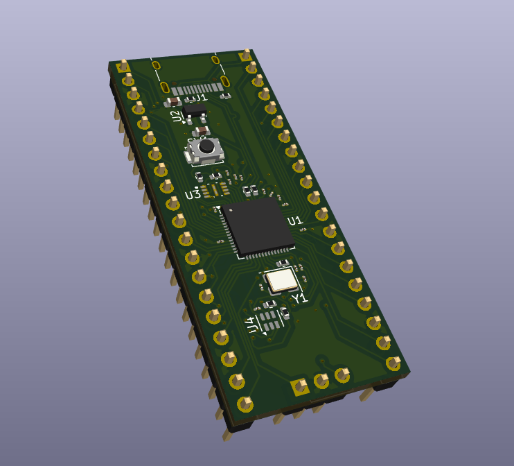
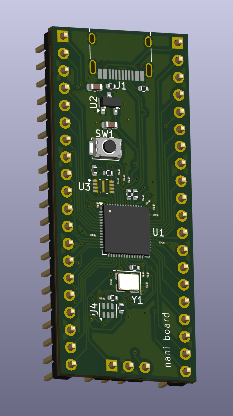

# an rp2040 dev board

This is a dev board based upon the RP2040 microcontroller, a 32-bit dual-core ARM Cortex-M0+. This board comes with 16mb of flash memory, a 12 MHz crystal oscillator, a USB-C for power with a Low-Dropout Regulator, and light sensing capabilites enabled using a TSL25911FN. I made this because I was interested in the use of various components for general RP2040 based boards. This was also my first time making a microcontoller in general, and I learned much about the purpose of various IC's and passive components in the process! 

| Item | Quantity | Product Link | Cost |
|------|----------|--------------|------|
| 1uF 0402 Cap | 2 | [link](https://jlcpcb.com/partdetail/SamsungElectro-CL05A105KA5NQNC/C52923) | $0.01 |
| 0.1uF 0402 Cap | 12 | [link](https://jlcpcb.com/partdetail/SamsungElectro-CL05B104KO5NNNC/C1525) | $0.01 |
| 33pF 0402 Cap | 2 | [link](https://jlcpcb.com/partdetail/TaiyoYuden-EMK042CH330JCW/C783027) | $0.01 |
| 10uF 0603 Cap | 2 | [link](https://jlcpcb.com/partdetail/2043-CL10A106MQ8NNNC/C1691) | $0.01 |
| 4.7K 0402 Resistor | 2 | [link](https://jlcpcb.com/partdetail/26643-0402WGF4701TCE/C25900) | $0.01 |
| 1K 0402 Resistor | 2 | [link](https://jlcpcb.com/partdetail/YAGEO-RC0100JR071KL/C327020) | $0.01 |
| 27 0402 Resistor | 2 | [link](https://jlcpcb.com/partdetail/YAGEO-RC0100JR0727RL/C850592) | $0.01 |
| 5.1K 0402 Resistor | 2 | [link](https://jlcpcb.com/partdetail/TyoHM-RMC04025_1K1N/C325521) | $0.01 |
| 10K 0402 Resistor | 1 | [link](https://jlcpcb.com/partdetail/259835-0105WHF1002TDE/C270305) | $0.01 |
| MCP1700x-330xxTT | 1 | [link](https://jlcpcb.com/partdetail/MicrochipTech-MCP1700T_3302ETT/C39051) | $0.39 |
| RP2040 | 1 | [link](https://jlcpcb.com/partdetail/RaspberryPi-RP2040/C2040) | $0.92 |
| W25Q16JVZPIQ TR | 1 | [link](https://jlcpcb.com/partdetail/WinbondElec-W25Q16JVZPIQTR/C2456208) | $0.90 |
| TSL25911FN | 1 | [link](https://jlcpcb.com/partdetail/AMS-TSL25911FN/C176812) | $1.74 |
| 12 MHz Crystal | 1 | [link](https://jlcpcb.com/partdetail/SeikoEpson-X1G0044510028/C32540) | $0.80 |
| Conn_01x20 (Pin Header) | 2 | [link](https://jlcpcb.com/partdetail/51993-2_54_1_20PStraightpin/C50981) | $0.21 |
| Conn_01x03 (Pin Header) | 1 | [link](https://jlcpcb.com/partdetail/50265-2_54_13PPin/C49257) | $0.02 |
| USB-C Receptacle | 1 | [link](https://jlcpcb.com/partdetail/Korean_HropartsElec-TYPE_C_31_M12/C165948) | $0.17 |
| Switch | 1 | [link](https://jlcpcb.com/partdetail/CK-KMR241GLFS/C221682) | $0.81 |

Total Parts Cost + PCBA + JLC Shipping = $13.83 + $3.20 + $24.26 = ($33.51 + taxes + feeder fees)*

*no need for grant - paying everything out of pocket
